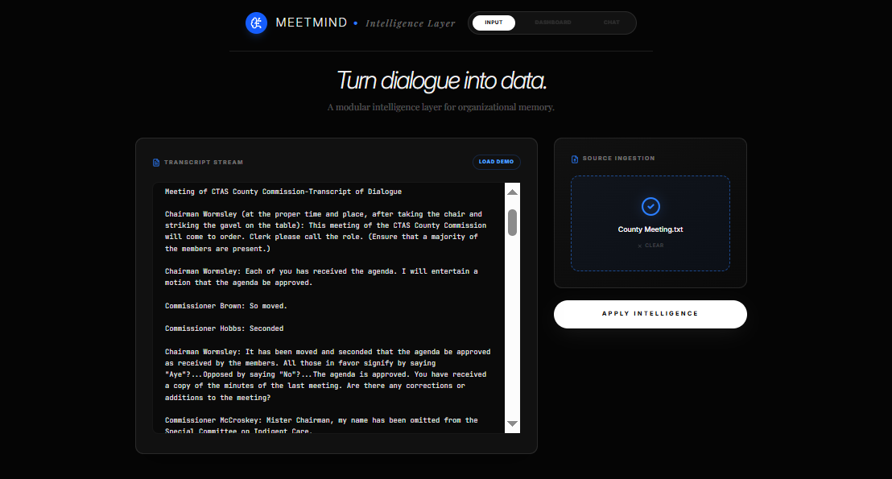
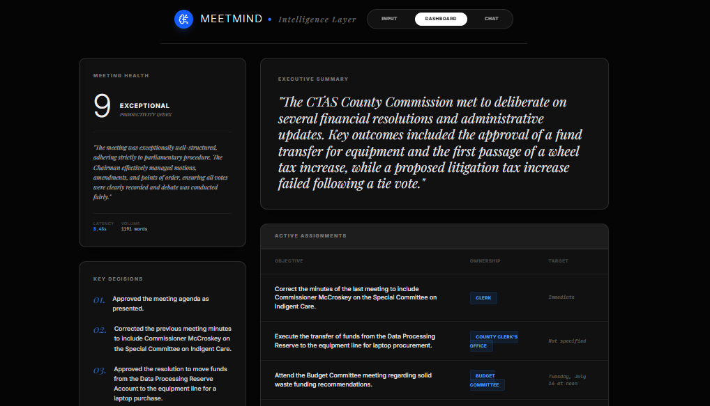
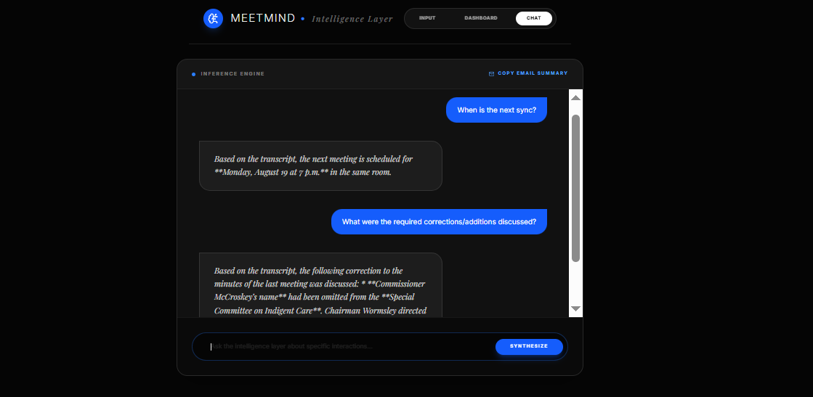

# MeetMind: Intelligence Layer for Meetings








MeetMind is a sophisticated, AI-powered meeting analysis tool designed to transform raw dialogue into actionable organizational intelligence. Built with a modular React architecture and a clean Express/Node.js backend, it leverages Google Gemini 1.5 to provide deep context, objective health scoring, and instant Q&A context.

## Key Features

- **Automated Intelligence**: Extracts summaries, core decisions, and action items with specific ownership and deadlines.
- **Productivity Scoring**: Analyzes meeting dynamics to provide a "Meeting Health" score and reasoning.
- **Transcript Interrogation**: A contextual chat interface that lets you ask nuanced questions about the meeting content.
- **System Telemetry**: Custom backend tracking for AI performance (latency, token volume) to demonstrate production readiness.
- **Modular Architecture**: Clean separation of concerns with domain-driven components and custom React hooks.

## Tech Stack

- **Frontend**: React 18, Vite, TypeScript, Tailwind CSS, Motion (for animations), Lucide React.
- **Backend**: Node.js, Express, tsx.
- **AI**: Google Gemini 1.5/3.5.
- **State**: Custom React Hooks for domain-specific logic.

## Project Structure

```text
├── server/               # Logic-heavy backend directory
│   ├── controllers/      # Route handler logic (Sanitization & Validation)
│   ├── services/         # Gemini API & Prompt Engineering (Service Pattern)
├── src/
│   ├── components/       # Atomic & Modular UI components
│   ├── hooks/            # useMeetingIntelligence (Domain State Logic)
│   ├── services/         # Client-side API abstractions
│   ├── types/            # Domain-specific TypeScript interfaces (shared)
│   └── App.tsx           # Layout Orchestrator
└── server.ts             # Unified Entry Point (Vite Middleware + API)
```

## Setup Instructions

1. **Clone & Install**:
   ```bash
   npm install
   ```

2. **Environment Configuration**:
   Create a `.env` file in the root (use `.env.example` as a template):
   ```env
   GEMINI_API_KEY=your_google_ai_studio_key
   ```

3. **Development Mode**:
   ```bash
   npm run dev
   ```

4. **Production Build**:
   ```bash
   npm run build
   npm start
   ```

## What I Learned Building This

- **Prompt Engineering**: Moving from basic strings to structured JSON schemas with Gemini ensures reliable API responses that can be directly mapped to UI components.
- **Architectural Scalability**: Refactoring from a single `App.tsx` into modular components and hooks dramatically improved readability and made debugging the AI pipeline significantly easier.
- **Full-Stack Integration**: Implementing Vite as a middleware within Express provided a seamless development experience for a unified application deployment.
- **AI UX**: Designing for "AI Latency" by adding loading skeletons and performance analytics provides a much more professional feel for real-world users.

---
*Created as a showcase of modern Full-Stack AI development.*

